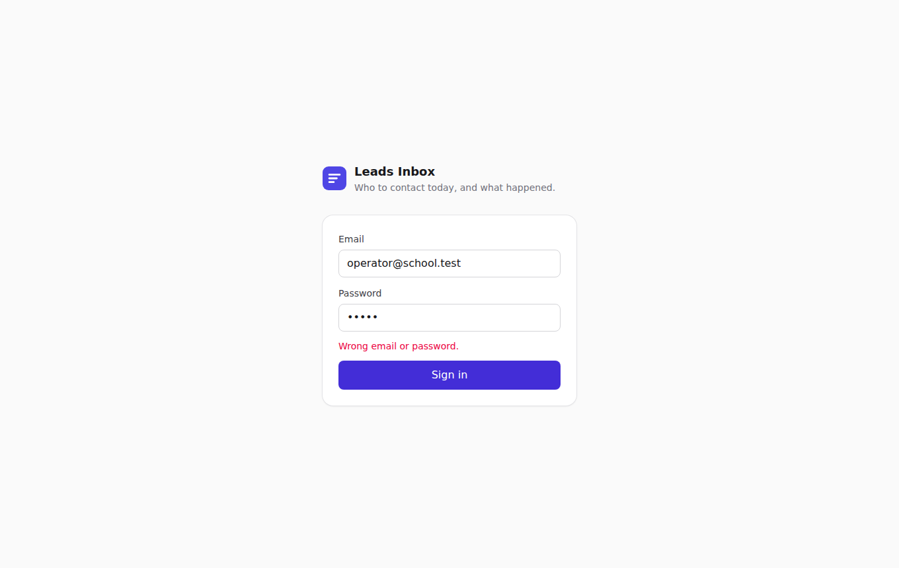
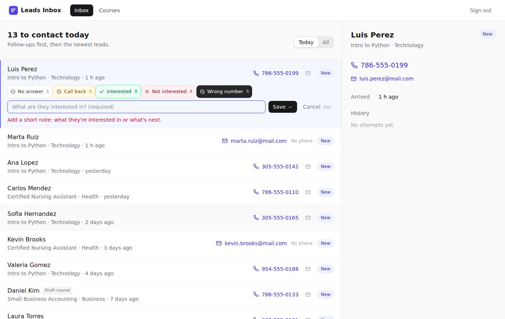
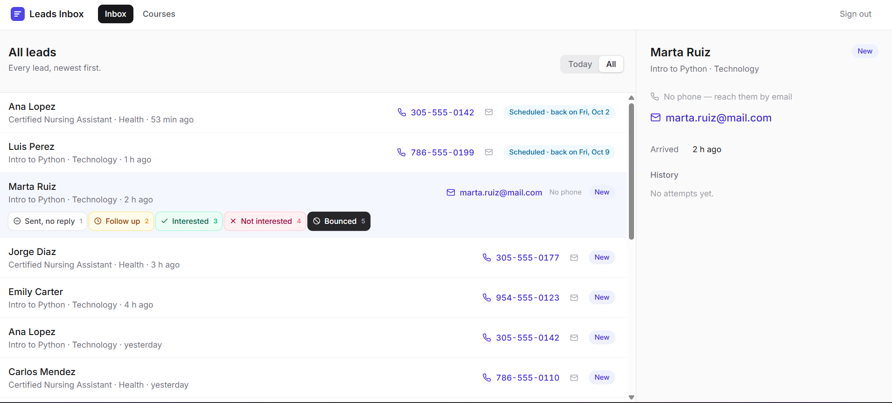
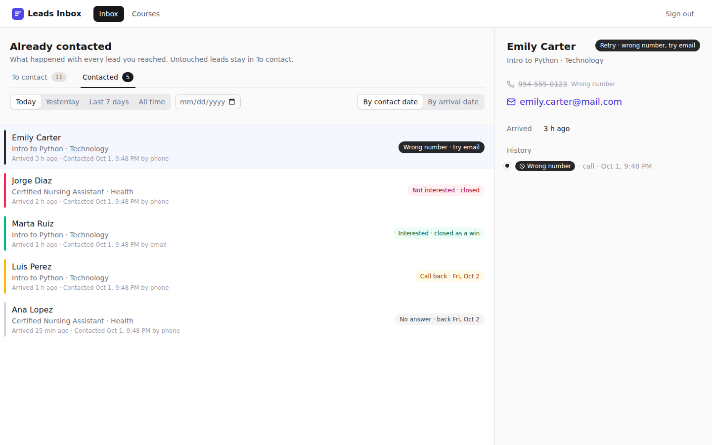
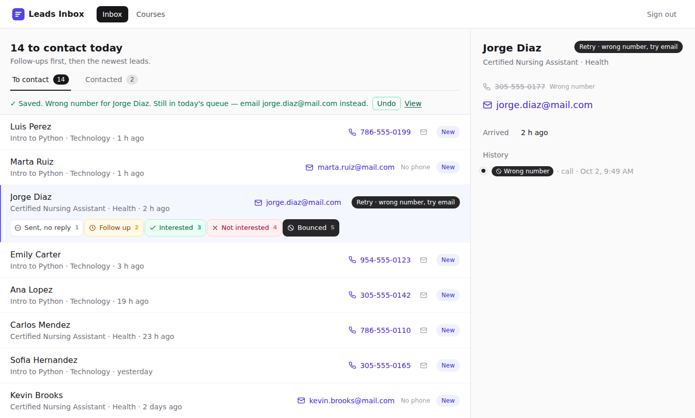

# Leads Inbox

Internal tool for a continuing-education school. A marketing operator signs in every morning, sees the courses and the leads that came in from the course landing pages, and works through who to contact. An AI assistant connected over MCP reads — and, for the invented feature, writes — the same data.

- **Backend:** Flask REST API + SQLite (SQLAlchemy), JWT sessions
- **Frontend:** React (Vite + Tailwind)
- **MCP:** Python server over stdio, official SDK ([modelcontextprotocol.io](https://modelcontextprotocol.io))
- **Timezone:** "today" is always the school's today, `America/New_York` (Miami)

The full step-by-step design, with the comparison against Close, Folk, Attio and LeadSquared, is in [`docs/WORKFLOW.md`](docs/WORKFLOW.md).

**Guía paso a paso para levantar el proyecto (en español): [`SETUP.md`](SETUP.md).**
**Cómo iniciar sesión: [`LOGIN.md`](LOGIN.md).**

---

## Part 1 — The base

### Requirements
- Python 3.11+
- Node.js 20+

### 1. API

```bash
python3 -m venv .venv
source .venv/bin/activate            # Windows: .venv\Scripts\activate
pip install -r requirements.txt
python -m backend.app                # http://127.0.0.1:5050
```

On first start the API creates `backend/leads.db` and seeds the day-1 data. To start over (dates are relative to the moment you seed, so "today" leads are today):

```bash
python -m backend.seed --reset
```

### 2. Screens

```bash
cd frontend
npm install
npm run dev                          # http://localhost:5173  (proxies /api to :5050)
```

### 3. Test user

| Email | Password |
|---|---|
| `operator@school.test` | `demo1234` |

See [`LOGIN.md`](LOGIN.md) for the sign-in steps, possible messages and how the session works.

### 4. Tests

```bash
pytest -q backend/tests
```

They cover the seed requirements, every rule and validation message of the invented feature, the queue order, the API and the MCP tools (same effect on the database from both sides).

### Day-1 data

3 courses — *Certified Nursing Assistant* (Health, published), *Intro to Python* (Technology, published), *Small Business Accounting* (Business, **draft**) — and 15 leads spread over today and the past week, including on purpose:

- the same email (Ana Lopez) in two different courses
- two leads without phone (Marta Ruiz, Kevin Brooks)
- one lead on the draft course (Daniel Kim, arrived before it became a draft)
- several leads from today and several from last week

The draft course does not accept new leads: `POST /api/leads` (which stands in for the landing form, the public site is out of scope) rejects it with *«Small Business Accounting» is a draft and is not accepting new leads.*

### REST API

| Method | Path | |
|---|---|---|
| `POST` | `/api/auth/login` | `{email, password}` → `{token}` |
| `GET` | `/api/courses` | Courses with status and open leads |
| `GET` | `/api/leads` | Today's queue (to contact) |
| `GET` | `/api/leads?scope=contacted&from=&to=&by=contact\|arrival` | Leads already contacted, filtered by contact or arrival date |
| `GET` | `/api/leads/{id}` | One lead with history |
| `POST` | `/api/leads/{id}/contacts` | **The invented feature** (see below) |
| `DELETE` | `/api/leads/{id}/contacts/{attempt_id}` | Undo the lead's last attempt (within 10 minutes) |
| `POST` | `/api/leads` | Intake, simulates the landing form |

Errors always come back as `{"error": "<plain-language message>"}`.

### MCP server — connect it to Cursor

The server lives in `mcp_server/server.py`. The client launches it as a process and talks JSON-RPC over stdin/stdout — no port, no HTTP, no OAuth. It imports the same `backend/services` functions the API uses, so there is one copy of the rules and one database.

Create `.cursor/mcp.json` in the project (or the global `~/.cursor/mcp.json`) and replace `/ABS/PATH` with the absolute path of this folder:

```json
{
  "mcpServers": {
    "leads-inbox": {
      "command": "/ABS/PATH/mcp-leads-manager/.venv/bin/python",
      "args": ["/ABS/PATH/mcp-leads-manager/mcp_server/server.py"],
      "env": {
        "DATABASE_URL": "sqlite:////ABS/PATH/mcp-leads-manager/backend/leads.db",
        "APP_TZ": "America/New_York",
        "OPERATOR_EMAIL": "operator@school.test"
      }
    }
  }
}
```

On Windows use `.venv\Scripts\python.exe` and `sqlite:///C:/path/to/backend/leads.db`.

Then open **Cursor → Settings → MCP**: «leads-inbox» should be green with 3 tools. Other MCP clients (Claude Desktop, etc.) take the same block in their own config file. To try the tools by hand without a client:

```bash
npx @modelcontextprotocol/inspector .venv/bin/python mcp_server/server.py
```

| Variable | Purpose |
|---|---|
| `DATABASE_URL` | Must point to the **same** SQLite file the API uses |
| `APP_TZ` | Same "today" as the API |
| `OPERATOR_EMAIL` | stdio has no login, so attempts logged from the assistant are recorded under this user |

**Base tools (read-only):**

| Tool | Returns |
|---|---|
| `list_leads` | Today's queue, in the order to work it: id, name, course, contact, state, arrival |
| `get_lead(lead_id)` | One lead: contacts, course, state, whether it's in today's queue, attempt history, other courses the same email asked about |

If something fails the tool says what happened in plain words, e.g. *There is no lead with id 99.* The server never writes to stdout (that's the protocol channel); logs go to stderr.

### Data model decisions

**Base fields** (from the brief): `users(email, name, password_hash)`, `courses(name, slug, area, status)`, `leads(name, email, phone?, course_id, created_at)`. Two leads with the same email are kept as separate rows — the brief doesn't decide whether they are the same person, so the detail only shows a hint («Also asked about …»). Dates are stored in UTC and turned into Miami time for "today", business days and every label.

**Added by the invented feature:** on `leads` — `status` (open/closed), `next_contact_on` (when it comes back to the queue), `closed_reason`, `phone_invalid`, `email_invalid`; and a new table `contact_attempts(lead_id, user_id, channel, outcome, note, follow_up_on, created_at, prev_state)` with one row per attempt (`prev_state` keeps the lead's state before the attempt, so it can be undone).



---

## La funcionalidad que inventé

### «Log contact»: log what happened, and the next step is decided for you

**The problem.** At 9:00 there are 40 leads and one hour. For each one the operator has to answer: *did I reach them, what happened, and when — and how — do I try again?* Without a tool that lives on paper or in memory: leads get called twice, promised call-backs get forgotten, and leads without a phone are simply skipped.

**What it does.** The focused lead in the inbox is expanded with five outcome buttons. The operator calls (or emails) from the row, then presses one button — or one key:

| Key | Phone | Email | What the server does |
|---|---|---|---|
| `1` | No answer | Sent, no reply | Back in the queue next business day. Closes after 3 tries |
| `2` | Call back | Follow up | Asks for a date (tomorrow → 30 days). Leaves the queue until that day |
| `3` | Interested | Interested | Asks for a short note. Closes the lead as a win |
| `4` | Not interested | Not interested | Closes the lead |
| `5` | Wrong number | Bounced | Marks that channel invalid. **If another channel is left the lead stays in today's queue and switches to it**; otherwise closes as unreachable |

The row slides out immediately and the next lead is focused (the save happens in the background; if the server rejects it, the row comes back with the message). A wrong click or key is not final: the confirmation has an **Undo** button (or `Ctrl+Z`) that deletes that attempt and puts the lead back exactly as it was — each attempt stores the lead's previous state, so the server restores it; only the last attempt of a lead, within 10 minutes. Every attempt is stored and shown in the lead's history. The result survives a reload — it's in the database, not in the browser.

It's one job: it starts and ends in the inbox, with no extra menu or screen. Leads without a phone are worked by email in the same queue — as long as there is a way to reach someone, the lead stays alive.



**One job, one place on the server.** The rules live once, in `backend/services/leads.py → log_contact()`. The screen calls it through `POST /api/leads/{id}/contacts`; the assistant calls it through the third MCP tool:

```
log_contact(lead_id, outcome, channel?, note?, follow_up_on?)
```

Same fields, same validations, same messages, same effect on the database. One lead per call, like each step on the screen. The two read tools reflect the result: a lead that leaves today's queue is no longer returned by `list_leads`, and `get_lead` says what state it's in.

**What else I considered — Morning triage.** A separate «Needs triage» view where the operator sorts leads into High / Standard / Nurture / Trash with single keys, then presses «Start dialing». I dropped it because (1) it needs a second screen and a pipeline, which the brief rules out; (2) its main effect is reordering the list, and a tag that only reorders is a single state change; (3) it doesn't answer what happened with the call. I kept its best idea: the operator never decides the order — the server sorts today's queue (promised follow-ups first, then the newest leads, then retries). I also considered merging leads that share an email and rejected it because the brief leaves identity undecided.

**Why this one.** It removes the most steps from the real 9:00 job: one key per lead instead of opening a record, writing a note and setting a reminder; the next step is decided by rules instead of memory; and no lead is lost just because one channel failed. It's the execution loop that tools like Close are known for, without needing a dialer.

Both checks were run with **Claude Desktop** as the MCP client (any MCP client works the same way), with the API and the screens running on the same machine. The answers below are the assistant's real replies, pasted verbatim.

### Check 1 — from the screen to the assistant

1. In the inbox, on **Ana Lopez** (Certified Nursing Assistant), click **No answer**. The row leaves today's queue and the counter drops to 14.
2. In a new assistant chat, ask: *"How is Ana Lopez doing? The nursing lead."* The assistant calls `get_lead`.

**Assistant's answer:**

> Ana Lopez (#1, Certified Nursing Assistant) is scheduled for a retry tomorrow, Friday Oct 2, so she's not in today's queue. Her lead came in about 40 minutes ago, and there's been one attempt so far: a call at 9:17 PM tonight that went unanswered. Her contact details are phone 305-555-0142 and email ana.lopez@mail.com.
>
> There's also a second Ana Lopez entry, #6, for Intro to Python. It uses the same phone number, arrived yesterday, and is still sitting as "New" in today's queue. Lead #1 also notes that she asked about Intro to Python, so #6 is probably the same person. If that's right, calling #6 today would mean contacting her twice: once today and again tomorrow. You might want to merge the two entries or skip #6 and handle both courses in tomorrow's call.

### Check 2 — from the assistant to the screen

1. In a new assistant chat, write: *"I called Luis Perez, he asked me to call him back on Friday, October 9 after 6 pm."* The assistant calls `log_contact` (outcome `follow_up`, date `2026-10-09`, note).

**Assistant's answer:**

> Logged. Luis Perez (Intro to Python) is scheduled for a callback on Friday, Oct 9, with a note that he asked for a call after 6 pm, and he's off today's queue.
>
> Next up is Marta Ruiz (#3, Intro to Python). She's email only, at marta.ruiz@mail.com.

2. Refresh the inbox: the counter shows **13 to contact today** and Luis is no longer in *Today*. Leads that leave today's queue are kept with their state (at the time of the check this view was called **All**; it is now the **Contacted** tab, see below) — Luis shows *Scheduled · back on Fri, Oct 9* (logged by the assistant) and Ana *Scheduled · back on Fri, Oct 2* (logged from the screen in Check 1):



### Following up on what was done: the «Contacted» tab

The inbox has two tabs with counters: **To contact** (today's queue, where the outcome bar lives) and **Contacted** (every lead that was reached at least once — untouched leads never show up there). In «Contacted» each row has the colour of its last outcome — the same colours as the buttons: grey *no answer*, amber *call back*, green *interested*, rose *not interested*, black *wrong number / bounced* — next to the word and what happens next («Call back · Fri, Oct 9», «Interested · closed as a win»), plus both dates: when the lead arrived and when it was contacted. A date filter (Today, Yesterday, Last 7 days, All time or a specific day) works **by contact date** or **by arrival date**. After logging an outcome, the confirmation has a «View» link that opens the lead there.



**Bonus — channel fallback.** Asking the assistant to log *wrong number* for Jorge Diaz returns *Saved. Wrong number for Jorge Diaz. Still in today's queue — email jorge.diaz@mail.com instead.* — and on the screen his phone is struck through and the row now offers the email outcomes:



---

## Out of scope

**Base:** no public site or landing pages (the intake endpoint stands in for the form); a single seeded operator, no user management.

**Invented feature:** no real telephony or email sending — the row opens `tel:` / `mailto:`; no auto-dial; undo only works on a lead's last attempt and for 10 minutes; the assistant has no undo tool (the brief allows a single third tool); US holidays are not skipped when computing business days.

## Project structure

```
backend/
  app.py               Flask app, JWT, error handling
  models.py            SQLAlchemy models (base + feature fields)
  seed.py              Day-1 data and test user
  timeutil.py          "Today", business days, labels — always in APP_TZ
  services/leads.py    Inbox, detail and log_contact — the single place for the rules
  routes/              Thin REST wrappers
  tests/               pytest
mcp_server/server.py   MCP server (stdio): list_leads, get_lead, log_contact
frontend/src/          React screens: SignIn, Inbox (rows, outcome bar, detail panel), Courses
docs/WORKFLOW.md       Step-by-step design and industry comparison
```
