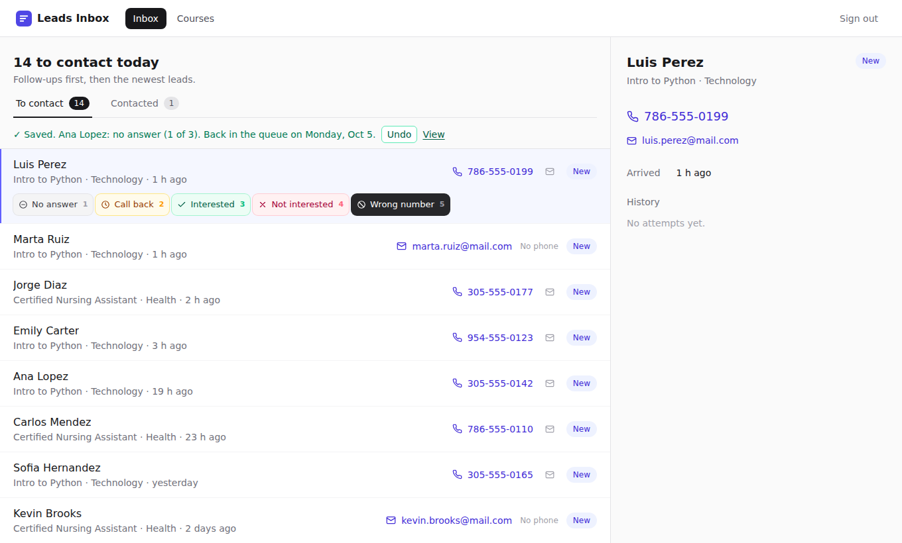

🇬🇧 English · [🇪🇸 Español](README.es.md)

# Leads Inbox

## What is this?

A school sells short courses. People who want a course leave their name and phone on a web page.

Every morning, one person from marketing has to call them. Let's call this person **the operator**.

This app is the operator's to-do list for those calls. It also has a helper you can chat with (an **AI assistant**) that sees the same list.

> **What does this word mean?**
> - **Lead:** one person who asked about one course. "Ana asked about Nursing" is one lead.
> - **Queue:** the list of leads to call today, in order.
> - **AI assistant:** a chat program (like Claude or Cursor) that can read and update the list for you.

**To install and start it, read [SETUP.md](SETUP.md).** Developers can find all the technical details in [docs/TECHNICAL.md](docs/TECHNICAL.md).

---

## How does a morning look?

It is 9:00. There are 40 people to call and one hour.

1. The operator opens the app and signs in.
2. The list shows who to call first. The app already put them in order.
3. The operator calls the first person.
4. After the call, the operator presses one button to say what happened.
5. That person leaves today's list, and the next one is ready.
6. Repeat until the list is empty. 🎉

---

## What is on the screen?

**At the top there are two tabs:**

- **To contact:** people to call today. The number tells you how many are left.
- **Contacted:** people you already reached. People nobody has called yet never show up here.

**Each person on the list shows:**

- their name and the course they asked about
- when they asked ("2 h ago")
- their phone number, or their email if they have no phone

Click the phone number to call. Click the email to write to them.

**On the right side** you see everything about the selected person, including every call made so far.

### The five buttons

After a call, press the button that matches what happened. You can also press the number key.

| Key | Button | Color | What happens next |
|---|---|---|---|
| `1` | **No answer** | grey | The person comes back the next workday. After 3 tries with no answer, we stop. |
| `2` | **Call back** | yellow | They asked you to call later. You pick the day. |
| `3` | **Interested** | green | 🎉 They want the course. You write a short note. Done! |
| `4` | **Not interested** | red | They said no. Done. |
| `5` | **Wrong number** | black | That number is bad. If we have their email, we try email instead. |

If the person has no phone, the buttons say "Sent, no reply", "Follow up" and "Bounced", because you contact them by email.

**The colors are always the same.** Yellow always means "call back", green always means "interested", and so on. That way you understand what happened just by looking.

### Made a mistake? Press Undo

After you press a button, a green message appears with an **Undo** button. Press it (or `Ctrl + Z`) and everything goes back to how it was.

You can also undo from the **Contacted** tab. Undo works for 10 minutes, and only on the last thing you did with that person.

### The «Contacted» tab

Here you see everyone you already reached, with the color of what happened.

You can look by date: **Today**, **Yesterday**, **Last 7 days**, **All time**, or pick a day. You can choose to search by the day you contacted them, or by the day they asked about the course.

---

## La funcionalidad que inventé — The feature I invented

### What problem does it solve?

At 9:00 there are 40 people and one hour. For each person, the operator must remember three things:

- Did I reach them?
- What did they say?
- When should I try again?

Without help, this lives on paper. People get called twice. Promises to call back get forgotten. People without a phone get skipped.

### What does it do?

It is called **Log contact**. After each call or email, the operator presses one of the five buttons. The app then decides the next step by itself:

- **No answer:** try again next workday. Stop after 3 tries.
- **Call back:** come back on the day the operator picked.
- **Interested:** close the lead as a win, with a note.
- **Not interested:** close the lead.
- **Wrong number:** if there is an email, keep the person and switch to email. If there is no other way to reach them, close the lead.

**The rule is simple: as long as there is a way to reach someone, we keep trying.**

Every call is saved. If you reload the page, everything is still there.

### The AI assistant can do it too

The assistant has three tools:

- **list_leads** shows today's list.
- **get_lead** shows one person.
- **log_contact** does the same as the five buttons.

The rules live in **one single place** on the server. The screen and the assistant both use that same place. So they always agree.

### What else did I think about?

I thought about a **morning sorting step**: before calling, the operator sorts every lead into "high", "normal", "later" or "trash".

I did not choose it, for three reasons:

1. It needs a second screen, and the task asked for one single job inside the inbox.
2. It mostly changes the order of the list, and the task says that is not enough.
3. It does not answer "what happened with the call?"

I kept its best idea: **the app puts the list in order for you**. People you promised to call come first, then the newest, then the retries.

### Why this one?

Because it saves the most steps at 9:00. One key per person, instead of opening a page, writing a note and setting a reminder. And nobody gets lost just because one phone number was wrong.

### Check 1: from the screen to the assistant

1. On the screen, on **Ana Lopez** (Nursing), I pressed **No answer**. She left today's list.
2. Then I asked the assistant: *"How is Ana Lopez doing? The nursing lead."*

**What the assistant really answered:**

> Ana Lopez (#1, Certified Nursing Assistant) is scheduled for a retry tomorrow, Friday Oct 2, so she's not in today's queue. Her lead came in about 40 minutes ago, and there's been one attempt so far: a call at 9:17 PM tonight that went unanswered. Her contact details are phone 305-555-0142 and email ana.lopez@mail.com.
>
> There's also a second Ana Lopez entry, #6, for Intro to Python. It uses the same phone number, arrived yesterday, and is still sitting as "New" in today's queue. Lead #1 also notes that she asked about Intro to Python, so #6 is probably the same person. If that's right, calling #6 today would mean contacting her twice: once today and again tomorrow. You might want to merge the two entries or skip #6 and handle both courses in tomorrow's call.

✅ The assistant saw what I saved on the screen.

### Check 2: from the assistant to the screen

1. I told the assistant: *"I called Luis Perez, he asked me to call him back on Friday, October 9 after 6 pm."*

**What the assistant really answered:**

> Logged. Luis Perez (Intro to Python) is scheduled for a callback on Friday, Oct 9, with a note that he asked for a call after 6 pm, and he's off today's queue.
>
> Next up is Marta Ruiz (#3, Intro to Python). She's email only, at marta.ruiz@mail.com.

2. I reloaded the screen. Luis was gone from today's list. He showed up as **"Scheduled · back on Fri, Oct 9"**. Ana showed up as **"Scheduled · back on Fri, Oct 2"** from Check 1.

*(This picture was taken with an older version, where the tab was called "All". Today it is the **Contacted** tab.)*

✅ The screen showed what the assistant saved.

---

## How is the information stored?

**From the task (the base):**

- **Users:** email, name and password (stored safely, scrambled).
- **Courses:** name, short web name ("slug"), area and status (published or draft).
- **Leads:** name, email, phone (can be empty), course and the date they asked.

Two leads with the same email stay as two separate leads. The task does not say if they are the same person, so the app only shows a hint: "Also asked about…".

**Added by my feature:**

- **On each lead**, five new facts:
  - Is it open or closed?
  - When do we try again?
  - Why was it closed?
  - Was the phone wrong?
  - Was the email wrong?
- **A new list of contact attempts.** One line for every call or email. Each line says:
  - who did it, and when
  - what happened, and a note
  - how the lead was before (so it can be undone)

---

## What was left out?

**From the base:**

- The public course web pages. The task said not to build them.
- Creating more users from the app. There is one test user.

**From my feature:**

- The app does not make real phone calls or send emails. It opens your phone or email app.
- No automatic dialing.
- Undo only works for 10 minutes, on the last action of each person.
- The assistant cannot undo. The task allowed only one extra tool for it.
- US holidays are not skipped when counting workdays.

---

## More documents

| Document | What it is for |
|---|---|
| [SETUP.md](SETUP.md) | Install, start, sign in and connect the assistant, step by step |
| [docs/TECHNICAL.md](docs/TECHNICAL.md) | For developers: how it is built, API, rules, data, tests |
| [docs/WORKFLOW.md](docs/WORKFLOW.md) | Full design notes, with a comparison against other tools |
